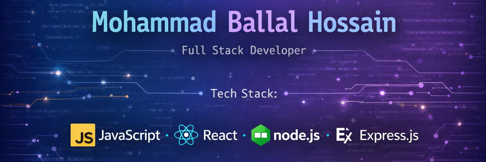

<h1 align="center">“Transforming concepts into high-performance web applications with JS, React, Node, Express & Next.js”</h1>
---
## 🌐 Connect With Me

  

  

  <!-- Google Business Profile -->
  

  <!-- Email -->
  
  

---
## 🧑‍💻 About Me
I am a passionate Full Stack Web Developer specializing in **JavaScript, React, Node.js, Express.js, Next.js, MongoDB, and Firebase**.  
I love building **fast, responsive, and scalable web applications** that solve real-world problems.  

- 🔭 I’m currently working on **personal and client projects**
- 🌱 I’m continuously learning **advanced React, Next.js, and cloud technologies**
- 💬 Ask me about **JavaScript, React, Node.js, or any web development topic**
- ⚡ Fun fact: I love **turning complex problems into simple, elegant solutions**

---

## 🛠 Skills & Tech Stack

### **Languages & Frameworks**

### **Databases**

### **Tools & Platforms**

---

## 💼 Projects
| Project | Description | Tech Stack | Live / Repo |
|---------|-------------|------------|-------------|
| **Freelance Marketplace** | Personal portfolio to showcase projects and skills | React, Next.js, Tailwind CSS | [Live](https://freelance-work-place.firebaseapp.com/) / [GitHub](https://github.com/Md-Ballal-Hossain/freelance-marketplace-client.git) |
| **bookshelf Website** | Online shopping app with cart and payments | React, Node.js, Express.js, MongoDB | [Live](https://book-shelpie.firebaseapp.com/) / [GitHub](https://github.com/Md-Ballal-Hossain/Book-Shelpie-Client.git) |

---

## 🏆 Achievements & Certifications
- Get Frontend Web Developer Certificate from "Programming Hero"

---

## ✉️ Contact
Feel free to reach out for **collaboration, mentorship, or freelance projects**!  
📧 Email: [YourEmail@example.com](mohammad.bhossain@gmail.com)  
🔗 LinkedIn: [YourLinkedInUsername](https://www.linkedin.com/in/ballal-web-developer/)

---

> “Let’s build something amazing together! 🚀”
